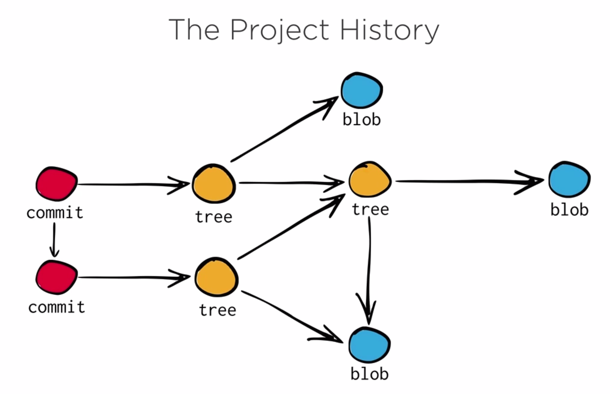

# GIT

Git almacena información en 4 áres, Working Area, Index, Repository y el Stash. 

* El Working Directory es la área directorio donde se trabaja y corresponde con el sistema de ficheros del SO. Es un área de trabajo temporal puesto que el objetivo final es almacenar los ficheros  y directorios en el Repository.
* El Repository contiene la historia de nuestro proyecto. Cuando se realiza un commit, es en esta área donde se ve reflejado.
* Entre el Working Directory y el Repository se situa el index, y es el área donde se ponen los ficheros previamente al commit.
* El stasth es una área de almacenamiento temporal. Es util.

Es importante preguntarse como los comandos de git mueven información entre estas áreas y también que comandos hacen cambios en el Repository puesto que es la área más importante de las cuatro.

Extendiendo un poco la información sobre Repository, en el directorio de trabajo se puede encontrar un directorio oculto llamado `.git`.  En este directorio, git almacenará toda la información necesaria para trabajar. Más concretamete hay un directorio llamado `objects` bastante interesante.

Hay diferentes tipos de objetos así algunos de ellos representan el contenido de un fichero en un punto específico en el la historia del proyecto, se denominan `blob`.  Otros objetos llamados `tree` representan  directorios en el proyecto y también hay `commit`. Todos estos objetos son inmutables, se puede crear o borrar pero nunca van a cambiar. Estos objetos están linkador para construir la historia del proyecto. 

Los commit son como una instantánea en el tiempo.