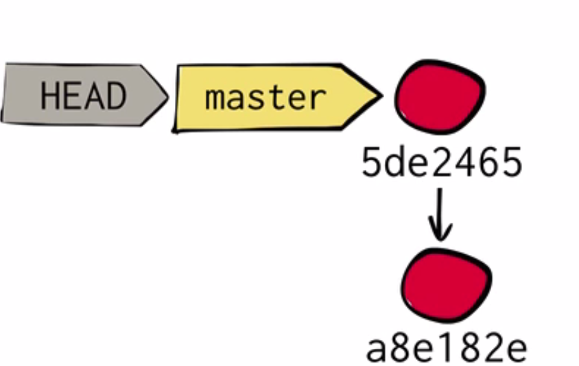
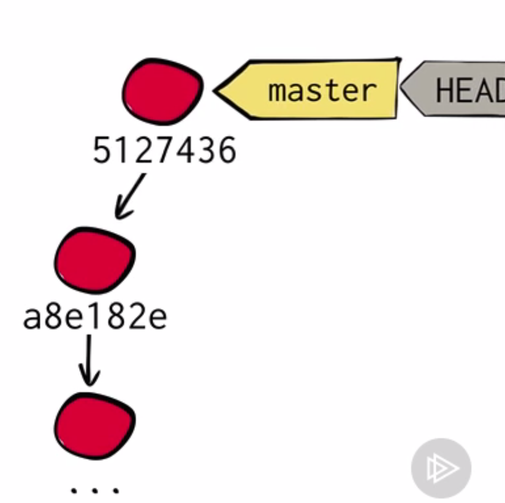

# Git

# Cambiar el último commit

A veces nos equivocamos al realizar un commit ya sea porque está incompleto debido a que falte algún fichero o veamos que se ha introducido un bug, en lugar de crear otro commit que solvente estas situaciones es recomendable modificar el último commit para así mantener una historía limpia. Para poder hacer esto se recurre al commando `git commit --amend`.

Pongamos un ejemplo para ver como funciona este comando. Hemos realizado un commit sobre nuestra historia, hemos continuado trabajando  y posteriormente hemos recordado que necesitamos añadir otro fichero, por la razón que sea, por lo que añadimos al Index el fichero que nos faltaba. El estado actual del historial del repositorio es simple en este punto.

Ahora se realiza el comando esperado, `git commit --amend`. Con esto no se crea un commit desde 0 sino que por el contrario ahora el commit incluye el nuevo fichero y el antiguo y se debe de añadir un nuevo mensaje para el commit.

Tras realizar esto, lo que ocurre es que el commit actual es copiado por git a otro commit, puesto que los commit ya hechos son inmutables, con el nuevo y antiguo fichero,y las referencias son movidas a este nuevo commit

Tras realizar esto, el recolector de basura de git elimina el antiguo commit.

 

