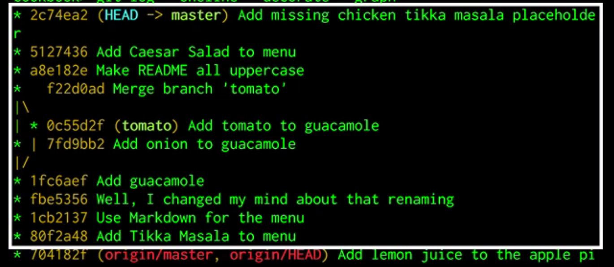
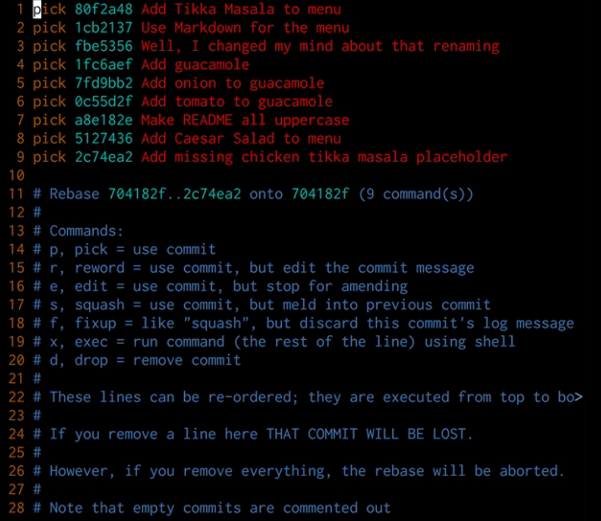

# Git

# Cambiar la historia con Rebase

Anteriormente hemos visto que para modificaf el último commit por algún fallo o cualquier otra circunstancia que hemos introducido en el, se realiza de una manera sencilla con `git commit --amend`, ¿pero qué ocurre si la modificación que se quiere hacer es en un commit anterior al último commit?. 

Pues para realizar esto se puede utilizar el comando `git rebase`, pero hay que recordar la regla de oro sobre la modificación de la historia, solo se puede modificar la historia de un repositorio  a partir de los últimos  commit que no se han compartido, porque si no se crearan muchos conflictos en el Repository.

Para realizar una explicación de como se puede realizar cambios en el historial de un Repository lo vamos a realizar por medio de un ejemplo.

En primer lugar se va a introducir un commit en el que se van a solucionar los cambios para solventar el fallo detectado y con posterioridad se va a fusionar este commit con el commit donse se introdujo el fallo que hemos corregido.

Para realizar la primera parte, simplemente añadidmos el nuevo commit con los cambio que solucionan el fallo, no hay nada más que decir sobre este aspecto.

Para poder realizar la fusión entre el nuevo commit y el commit donde se introdujo el fallo  se va a utilizar `git rebase --interactive`. En este comando la palabra rebase no solo significa rebase, tambien implica cambios en la historia. Y para poder hacer esto se necesita añadir una referencia al commmit padre por el cuál se quiere comenzar a cambiar el historial. Así por ejemplo si queremos hacer cambios a partir de la última vez que nos comunicamos con el servidor remoto, sería `git rebase --interactive origin/master`. En la siguiente imagen se muestran los commits a los que va afectar el rebase.

Cuando se ejecuta el comando, nos aparecera el editor interactivo que tengamos configurado, donde se mostrarán el listado de commits que se a ver afectados por el rebase junto con las acciones que se pueden realizar sobre ellos. Hay que recordar que el commit es inverso al que apaece en el log.

Lo que hace rebase es leer este fichero para saber que acciones tiene que realizar cuando esta en el proceso de rebase. Empieza a leer el fichero de arriba hacia abajo, y toma el valor de la segunda columna para determinar lo que tiene que hacer al crear el nuevo historial. Por defecto aparece  el texto `pick`, que unicamente copia el commit, por lo que si se deja tal y como aparece no reescribe la historia puesto que no se realiza ningún cambio sobre ella.. 

Debajo del listado de commits aparecen las acciones disponibles sobre estos, así si se quiere cambiar el mensaje de un commit en particular se cambia la palabra `pick` por `reword`. Se puede cambiar el orden de los commits, fusionarlos con `squash`. Cuando se guarde el fichero y se cierre el editor interactivo, la acción del rebase comenzará. Dependiendo de las acciones que se hayan configurado git pordá pausar la ejecucción del rebase debido a que necesita intervencción del usuario para saber como debe de actuar. Por ejemplo si se ha configurado para que se cambie el nombre de un commit, cuando se llegue a este commit en el rebase, git pausará la ejecucción, abrirá el editor interactivo para que el usuario introduzca el nuevo mensaje para el commit. Una vez que el usuario lo haya realizado, git continuará con el rebase. Un punto importante aquí es que al crear un nuevo commit, los commit posteriores a este, aunque tenga la instrucción `pick` deben de ser copiados (generando un nuevo commit identido al original), con la referencia al nuevo padre ya que los commits son inmutables y no se pueden cambiar el link del antiguio commit al nuevo commit creado al hacer `pick`. 

Mencionar que se pueden fusionar más de dos commits. Cuando se está haciendo un rebase y hay un conflicto entre ficheros el rebase se detiene, esperando que hagamos alguna acció para resolver los conflictos.  Una vez hecho los cambios necesarios se puede retomar el rebase con `git rebase --continue`.

Una vez terminado el rebase, git mueve los puntero al nuevo commit para que el garbage collector borre los antiguos.